# Becoming a Resolver

Learn how to become a Horizon Resolver and help resolve disputes in the protocol.

## What is a Resolver?

Resolvers are trusted community members who help resolve disputes between mission posters and performers. When a dispute arises, Resolvers review evidence from both parties and make fair decisions to ensure the platform remains trustworthy.

## Requirements

To become a Resolver, you must meet the following criteria:

### Level Requirement

You must reach **Level 15 (Pioneer)** with a minimum of **11,000 XP**.

| Your Current Level | XP Needed for Level 15 |
|--------------------|------------------------|
| Level 5 (Explorer) | 10,375 more XP |
| Level 10 (Adventurer) | 7,725 more XP |
| Level 12 (Wayfarer) | 5,475 more XP |
| Level 14 (Trailblazer) | 2,175 more XP |
| Level 15+ | ✅ Already eligible |

### Resolvers Guild Membership

Once you reach Level 15, you must join the **Resolvers Guild**. This is a protocol-level guild that maintains quality standards for dispute resolution.

**Resolvers Guild Requirements:**
- Level 15+ (11,000+ XP) 
- Minimum 80 reputation score
- Clean dispute history (no major infractions)

## Path to Resolver

```mermaid
flowchart LR
    A["Level 1<br/>Newcomer"] --> B["Level 5<br/>Explorer"]
    B --> C["Level 10<br/>Adventurer"]
    C --> D["Level 15<br/>Pioneer"]
    D --> E["Join Resolvers<br/>Guild"]
    E --> F["✅ Active<br/>Resolver"]
    
    style D fill:#4ade80,stroke:#22c55e
    style F fill:#22c55e,stroke:#16a34a,color:#fff
```

### Estimated Time to Level 15

| Missions/Week | Estimated Time |
|---------------|----------------|
| 5 missions | ~40 weeks |
| 10 missions | ~20 weeks |
| 20 missions | ~10 weeks |

*Assumes average 50 XP per mission with good ratings and streak bonuses.*

## Resolver Responsibilities

As a Resolver, you will:

1. **Review Disputes** - Examine evidence submitted by both parties
2. **Make Fair Decisions** - Determine outcomes (Poster Wins, Performer Wins, or Split)
3. **Provide Reasoning** - Document your decision with clear justification
4. **Maintain Neutrality** - Never resolve disputes involving yourself or friends

## Resolver Rewards

| Reward Type | Amount |
|-------------|--------|
| Resolver Pool Share | 2% of mission rewards |
| DDR Fee | 20% of dispute reserve |
| XP for Resolution | +50 XP per resolved dispute |
| Dispute Won (as party) | +100 XP |

## Dispute Resolution Process

```mermaid
flowchart TB
    A["🎯 Dispute Created"] --> B["📝 Evidence Submitted"]
    B --> C["👤 Resolver Assigned"]
    C --> D["🔍 Investigation"]
    D --> E{"Decision Made"}
    E --> F["Poster Wins"]
    E --> G["Performer Wins"]
    E --> H["Split Decision"]
    F --> I["⏰ 48h Appeal Period"]
    G --> I
    H --> I
    I --> J["✅ Finalized"]
```

### Dispute States

| State | Description |
|-------|-------------|
| **Pending** | Dispute raised, awaiting resolver assignment |
| **Investigating** | Resolver reviewing evidence |
| **Resolved** | Decision made, 48-hour appeal window |
| **Appealed** | Decision appealed to DAO |
| **Finalized** | Final outcome, funds distributed |

## Best Practices

1. **Be Thorough** - Review all submitted evidence carefully
2. **Be Timely** - Resolve disputes within 48-72 hours
3. **Be Fair** - Consider perspectives from both parties
4. **Be Clear** - Provide detailed reasoning for your decisions
5. **Be Consistent** - Apply the same standards to similar cases

## Getting Started

1. **Check your level** - Use the app to see your current XP and level
2. **Reach Level 15** - Focus on completing missions with high ratings
3. **Join Resolvers Guild** - Apply through the Guilds section once eligible
4. **Start Resolving** - Access the Resolver Queue to see pending disputes

---

Ready to help maintain trust on Horizon? Start your journey to Level 15 today!
