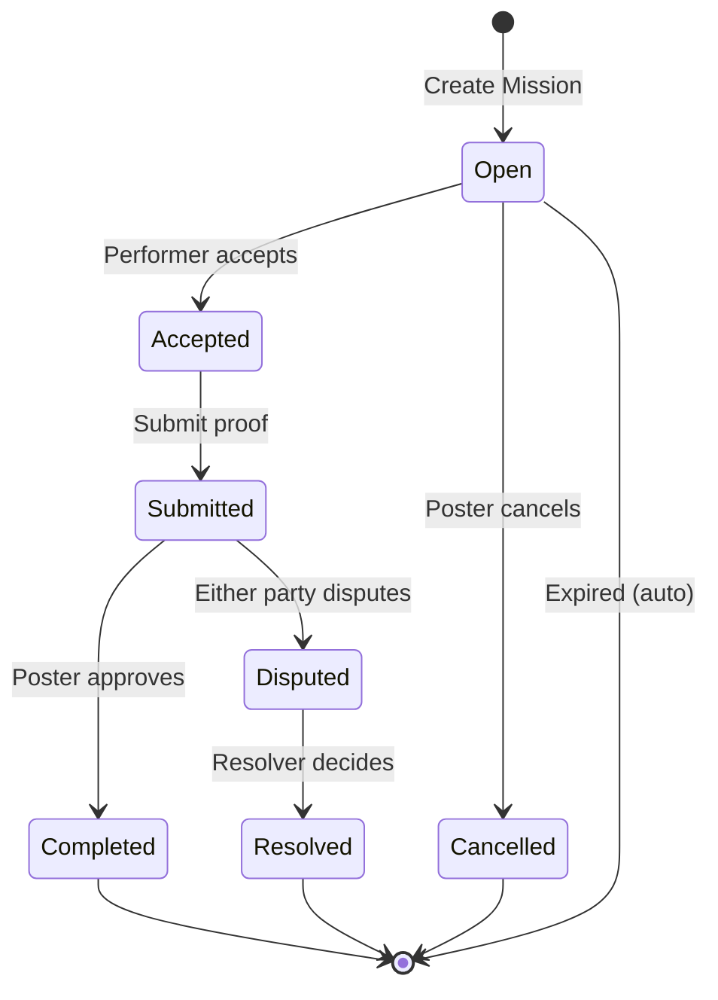

# Mission Engine

The Mission Engine is the core coordination mechanism of Horizon Protocol.

## Overview

A mission represents a real-world task with:
- **Escrow**: USDC locked until completion
- **Location**: Optional geofenced area
- **Deadline**: Expiration timestamp
- **Proof**: Evidence of completion

## Lifecycle States



## State Details

### Open

Initial state after mission creation.

**Properties:**
- Funds escrowed in contract
- Any eligible user can accept
- Poster can cancel (full refund)
- Auto-expires at deadline

**Transitions:**
- `acceptMission()` → Accepted
- `cancelMission()` → Cancelled
- Time-based → Expired

### Accepted

Performer has committed to the mission.

**Properties:**
- Performer address locked
- Countdown to deadline begins
- Cannot be cancelled by poster

**Transitions:**
- `submitProof()` → Submitted

### Submitted

Performer has submitted proof of completion.

**Properties:**
- Proof hash stored on-chain
- Poster must review
- Either party can dispute

**Transitions:**
- `approveCompletion()` → Completed
- `raiseDispute()` → Disputed

### Completed

Mission successfully completed.

**Properties:**
- Escrow settled via PaymentRouter
- 5-way fee split executed
- Reputation attestations emitted

### Disputed

Mission in dispute resolution.

**Properties:**
- DDR deposits required
- Resolver assigned
- Evidence collection period

**Transitions:**
- `resolveDispute()` → Resolved

## Mission Parameters

### Immutable (set at creation)

| Parameter | Type | Description |
|-----------|------|-------------|
| `rewardAmount` | uint256 | USDC reward (6 decimals) |
| `expiresAt` | uint256 | Unix timestamp deadline |
| `poster` | address | Creator's address |
| `guild` | address | Associated guild (optional) |
| `metadataHash` | bytes32 | IPFS hash of details |
| `locationHash` | bytes32 | IPFS hash of encrypted location |

### Runtime (mutable)

| Parameter | Type | Description |
|-----------|------|-------------|
| `performer` | address | Acceptor's address |
| `state` | enum | Current state |
| `proofHash` | bytes32 | IPFS hash of proof |
| `disputeRaised` | bool | Dispute flag |

## Location Requirements

### Geofence Types

| Precision | Revealed | Use Case |
|-----------|----------|----------|
| Exact (0) | Full address after accept | Specific delivery |
| Block (1) | Street block | Area-based tasks |
| Neighborhood (2) | District only | Privacy-sensitive |

### Presence Verification

Performers can verify their location:

```
POST /missions/:id/verify-presence
{
  "latitude": 38.7225,
  "longitude": -9.1395,
  "accuracy": 10
}
```

Response indicates if within geofence radius + GPS grace period.

## XP Rewards

| Action | XP Award |
|--------|----------|
| Complete mission | 10-50 XP (based on reward) |
| First mission | +25 XP bonus |
| Perfect rating | +10 XP bonus |
| Mission streak (5+) | +15% XP bonus |

## Security Invariants

1. **Funds are immutable**: `rewardAmount` cannot change
2. **Performer is locked**: Once accepted, cannot change
3. **State transitions are ordered**: Follow state machine strictly
4. **Escrow is non-custodial**: Service cannot modify funds

